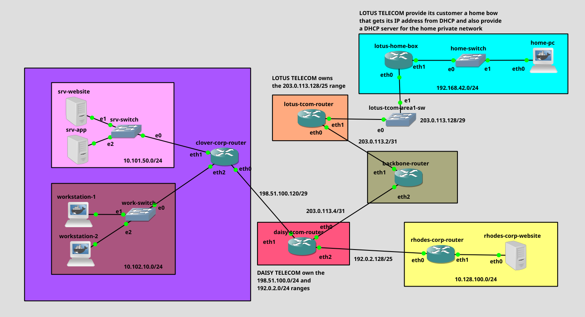

# Internet Infrastructure Simulation

## Project Overview
This repository contains the final practical project for the advanced networking module. The main objective is to simulate a functional, small-scale Internet environment that interconnects multiple real-world entities: corporate networks, Internet Service Providers (ISPs), a core backbone, and a residential home network. 

The architecture implements a combination of public routable IPv4 addresses and private subnets (RFC 1918), requiring robust Network Address Translation (NAT) mechanisms and strict stateful firewall policies. 

All network configurations (routing, firewalls, DHCP scopes, and web services) have been fully automated to ensure persistence and flawless behavior upon cold reboots.

---

## Network Architecture & Topology



The infrastructure is logically divided into several key autonomous areas:

1. **Internet Backbone (`backbone-router`)** : The core of the Internet simulation...

The infrastructure is logically divided into several key autonomous areas:

1. **Internet Backbone (`backbone-router`)** : The core of the Internet simulation, interconnecting ISPs using point-to-point links (`/31`) and aggregated static routing.
2. **Daisy Telecom (`daisy-tcom-router`)** : A professional corporate ISP managing two large distinct IP allocations (`198.51.100.0/24` and `192.0.2.0/24`) for its business clients.
3. **Lotus Telecom (`lotus-tcom-router`)** : A consumer-grade broadband ISP that dynamically leases public IPv4 addresses to residential subscribers using DHCP.
4. **Clover Corp (`clover-corp-router`)** : A corporate network featuring a secured DMZ subnet for servers (`10.101.50.0/24`) and a dynamic employee workstation subnet (`10.102.10.0/24`).
5. **Rhodes Corp (`rhodes-corp-router`)** : A lightweight business network hosting a dedicated corporate web server accessible globally.
6. **Residential Network (`lotus-home-box`)** : A standard customer premises equipment (CPE/Router) managing a private home local area network (`192.168.42.0/24`).

---

## Implemented Concepts & Technologies

### 1. Infrastructure Routing
* **Static Routing**: Aggregated routes configured on the Backbone router to handle ISP IP ranges efficiently without bloating the routing table.
* **IP Forwarding**: Systematically enabled IPv4 packet forwarding at the kernel level (`net.ipv4.ip_forward=1`) on all transit nodes.

### 2. Network Services (DHCP & HTTP)
* **DHCP Servers (`dhcpd`)**: Automated and persistent DHCP daemons with lease isolation (`dhcpd.leases`) deployed across Clover Corp, Lotus Telecom, and the Home Box.
* **Web Servers (`httpd` / Nginx)**: Lightweight HTTP services configured to launch automatically as soon as the corresponding network interfaces face up.

### 3. Security & Network Address Translation (`iptables`)
* **Destination NAT (DNAT)**: Precise port forwarding rules on port 80 to redirect external public traffic to internal private server IPs at Clover Corp and Rhodes Corp.
* **Source NAT (SNAT) & MASQUERADE**: IP translation used to grant Internet access to private hosts. The `MASQUERADE` target is specifically implemented on the Home Box since its public WAN interface IP is dynamically assigned via DHCP.
* **Strict Firewall Policies**:
  * Only ICMP (Ping) traffic is allowed directly to the Clover Corp router itself.
  * Stateful packet tracking (`-m state --state RELATED,ESTABLISHED`) handles all return traffic safely.
  * **Network Isolation**: Strict firewall rule denying the server subnet from initiating any connection towards the internal employee workstations, mitigating lateral movement risks in case a server gets compromised.

---

## Verification & Proof of Concept

The full routing and security policy has been validated. Initiating an HTTP request from the residential `home-pc` (behind a double NAT layer) all the way to the Rhodes Corp web server across the Backbone successfully returns the expected JSON payload:

```json
{
  "hostname": "rhodes-corp-website",
  "client_ip": "203.0.113.130"
}

```

---

## Repository Structure

The source files are structured to allow clear configuration inspection directly from any web browser without needing to open GNS3:

```text
.
├── README.md                     # Project documentation and details
├── project.gns3project           # Portable GNS3 project archive (ready to import)
└── configs/                      # Raw text configuration files for all nodes
    ├── backbone-router_interfaces.txt
    ├── daisy-tcom-router_interfaces.txt
    ├── lotus-tcom-router_interfaces.txt
    ├── lotus-home-box_interfaces.txt
    ├── home-pc_interfaces.txt
    ├── clover-corp-router_interfaces.txt
    ├── srv-website_interfaces.txt
    ├── srv-app_interfaces.txt
    ├── workstation-2_interfaces.txt
    ├── rhodes-corp-router_interfaces.txt
    └── rhodes-corp-website_interfaces.txt

```

---

## 💻 How to Import and Run the Project

1. Ensure **GNS3** is installed and configured along with the necessary Alpine/Docker images.
2. Download the `project.gns3project` file from this repository.
3. Open GNS3 and go to **File** -> **Import portable project**, then select the file.
4. Start all the nodes simultaneously. The built-in `post-up` scripts will automatically build the routing tables, start the DHCP services, and inject the firewall rules.

